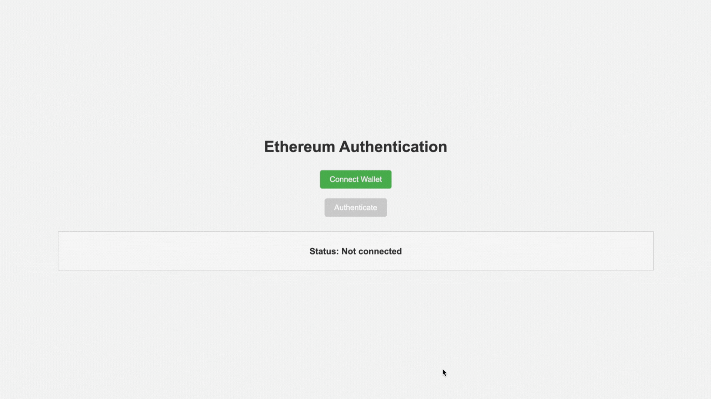

#  Showcase of Go Service Authentication with MetaMask

This project demonstrates how to authenticate users with MetaMask, Phantom or any other browser wallet that supports Ethereum network.
It provides a simple web interface that allows users to connect their MetaMask wallet and display their Ethereum address.



## Usage

- Click the **Connect Wallet** button to prompt the MetaMask wallet or some other to connect.
- Once connected, your Ethereum account address will be displayed on the page.
- If there are any errors during the connection, appropriate messages will be shown.

## Installation

### Binary Release

The easiest way to install **eth-auth** is to download pre-built binaries for your platform. 
You can find them on the [Releases](https://github.com/fmiskovic/eth-auth/releases) page.

### From Source

If you want to build the application from source, you can follow these steps:

Prerequisites:

- Go programming language installed
- MetaMask browser extension installed

1. Clone the repository:

   ```bash
   git clone https://github.com/fmiskovic/eth-auth.git && cd eth-auth
   ```

2. Run the server:

   ```bash
   make run
   ```

3. Open your browser and navigate to `http://localhost:8080` to see the application and authenticate.


## How it Works

This Go service integrates MetaMask authentication using the Ethereum blockchain to verify users. The service provides two main API endpoints: `/nonce` and `/auth`. Below is an outline of how the process works:

1. **User Connects to MetaMask:**
   - The front-end prompts the user to connect their MetaMask wallet.
   - The user's Ethereum account (wallet address) is retrieved once they approve the connection.

2. **Request a Nonce (Server-Side):**
   - Once connected, the front-end sends a request to the server to obtain a unique **nonce** via the `/nonce` endpoint.
   - The server generates a random nonce and associates it with the user’s Ethereum address.
   - This nonce is sent back to the client.

3. **User Signs the Nonce (Client-Side):**
   - The front-end uses MetaMask to request that the user sign the nonce with their private key.
   - MetaMask provides the signature, which is sent back to the server in an authentication request.

4. **Server Verifies Signature:**
   - The server verifies the signature using the public Ethereum address.
   - If the signature matches, the authentication is successful.
   - The server can then issue a session token (or similar) to manage user sessions.


#### Security Note:
- Nonce values are used to prevent replay attacks, ensuring that each authentication attempt is unique.
- It’s important to securely manage session tokens (or other forms of session management) after successful authentication.


## Project Structure

```
.
├── api
│   │── api.go              # API endpoints initialization and routing
│   │── error.go            # Error handling for the API
│   │── handler.go          # Request handlers for the API
│   │── handler_auth.go     # Request handlers for the authentication
│   └── handler_nonce.go    # Request handlers for the nonce generation
├── logging                     
│   └── logging.go          # Logger used across the application   
├── server
│   └── server.go           # Server configuration and initialization          
├── static
│   ├── style.css           # Styles for the web application
│   ├── script.js           # JavaScript for MetaMask authentication
│   └── index.html          # Main HTML file
├── store
│   └── storer.go           # In-Memory Store for nonce values 
├── main.go                 # Main entry point of the application
└── README.md               # Project documentation
```

## License

This project is licensed under the MIT License

## Acknowledgments

- [Ethers.js](https://docs.ethers.io/v6/) for Ethereum JavaScript library.
- [MetaMask](https://metamask.io/) for the Ethereum wallet browser extension.
